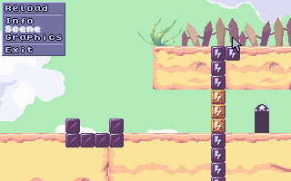
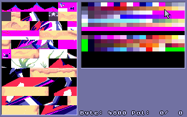

## What is it?

This is an ancient DOS project in x86 asm. It's not actively updated anymore, but here's the source for those who asked. Should I clean it up more? Yes. Will I? Nope.

See [Project Page](http://pikensoft.com/programs-bgmapper.html) and [BgMapper.txt](doc/BgMapper.txt) for more.

 
<small>Scene viewer showing <a href="https://goldlocke.itch.io/dottie-dreads-nought">Dottie Dreads Nought by Goldlocke</a></small>

 
<small>VRAM viewer showing <a href="https://goldlocke.itch.io/dottie-dreads-nought">Dottie Dreads Nought by Goldlocke</a></small>

## Building

See [Building.txt](doc/Building.txt):

Source files:
- src/BgMapper.asm - Main entry point and most logic
- src/BgmFuncs.asm - All of the helper routines for this prog
- src/BgTile.asm - Tile conversion, savestate loading, scene rendering
- src/Memory.inc - Memory allocation (thanks to Gaz Jones)
- src/System.inc - Program startup/shutdown
