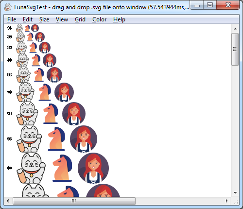
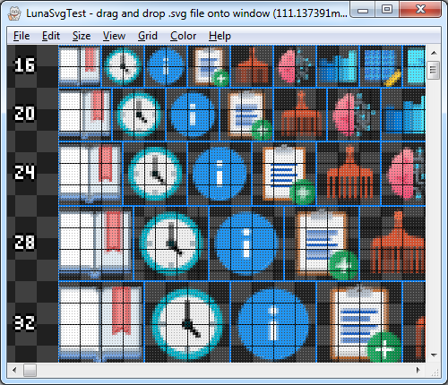
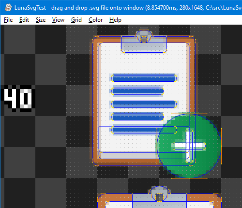

# LunaSvgSampleTest

Dwayne Robinson 2022-03-27 to 2022-04-02

## What is it?
Just a test of [LunaSvg](https://github.com/sammycage/lunasvg) to see how it works and if I can incorporate it into another project (LunaSvg is wonderfully stand-alone with no large framework dependencies like Skia or Cairo) and also to *someday* experiment with various SVG extensions for grid-fitting icons to get crisper toolbar icons.

## Usage
- **OS**: Windows 7+
- **Installation**: Portable app, and so just unzip the files into a folder where you want them - no bloated frameworks or dependencies needed.
- **Running**: Double click LunaSvgTest.exe, and open the file(s) you want or drag&drop files.
- **License**: [License.txt](License.txt) tldr: Do whatever you want with the binary at no cost.

## Building
- Open the CMake project with Visual Studio (confusingly to open a CMake project, you have to open the project via "Open Folder" instead of "Open Project").

## Features
- Opens simple non-animated SVG's. Nearly every SVG I've tried loads. I've seen a few fail to load in LunaSvg if they use other units (like "1em"), but deleting the "em" from the file or replacing it with the equivalent "px" size fixes it. Some icons don't render quite the same as in the browser environment because of inherited CSS properties, but they do render the same as the browser for the isolated file (e.g. certain Facebook icons).
- Multiple sizes: fixed size, natural size, window size, waterfall display
- Pixel zoom: to see the actual rendering up close (Ctrl+mouse wheel or +/- keys)
- Grid display ('g' key)

## Bug reports
I'm unlikely to add more features to this app, because this is just a side project anyway, but let me know if you encounter bugs in the app itself. Any SVG loading or rendering issues are most likely in LunaSvg (sorry, I don't have more diagnostic info accessible to print out the specific error).

## Related
- LunaSVG - https://github.com/sammycage/lunasvg
- SVG specification - https://github.com/w3c/svgwg/tree/master
