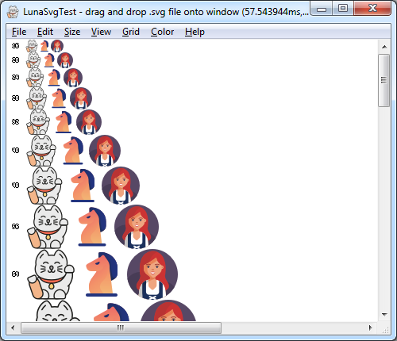

# LunaSvgTest

Dwayne Robinson 2022-03-27

## What
Just a test of [LunaSvg](https://github.com/sammycage/lunasvg) to see how it works and if I can incorporate it into another project (LunaSvg is wonderfully stand-alone with no large framework dependencies like Skia or Cairo) and also to (someday) experiment with various SVG extensions for grid-fitting icons to get crisper toolbar icons.

## Usage
- **OS**: Windows 7+
- **Installation**: Portable app, and so just unzip the files into a folder where you want them - no bloated frameworks or dependencies needed.
- **Running**: Double click LunaSvgTest.exe, and open the file(s) you want or drag&drop files.
- **License**: [License.txt](License.txt) tldr: Do whatever you want with the binary at no cost.

## Building
- Open the CMake project with Visual Studio (confusingly to open a CMake project, you have to open the project via "Open Folder" instead of "Open Project").

## Features
- Opens simple non-animated SVG's. I've seen a few fail to load in LunaSvg if they use other units (like "1em"), but otherwise every one I've tried load.
- Multiple sizes: fixed size, natural size, window size, waterfall display
- Pixel zoom: to see the actual rendering up close
- Grid display (

## Related

- LunaSVG - https://github.com/sammycage/lunasvg
- SVG specification - https://github.com/w3c/svgwg/tree/master
