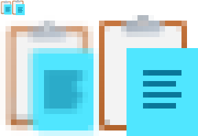

# 🚧 SVG Pixel Snapping (Grid Fitting) 🚧
Dwayne Robinson 2026-10-01

# Why - The Problem

SVG is great for resolution independent iconography, but try rendering icons to sizes they weren't designed for, and notice...

- The blurry borders and collapsed lines of text on the page:

  

- The asymmetric connectors with a mix of crisp lines and muddy gray lines:

  

TODO: Insert more images showing problems. Include: blurry lines, excess detail which becomes a blurry mess, detail collapse, minimum pixel distance, contour offset.
TODO: Add Pencil for 45 degree angle - LunaSvgTestData\icons8.com\icons8-office-edit XS 16x16.svg
TODO: Dotted gridlines that collapse at 24px - LunaSvgTestData\icons8.com\icons8-fluency-select-all.svg

# What

This document extends SVG with microadjustment attributes to snap to pixels and remedy those fuzzy edges/smudgy details when the graphic is rendered at sizes it wasn't an intended multiple of, especially for small size scenarios (e.g. iconography in toolbars, menus, webpage links) on medium-DPI displays (e.g. 24x24px, 32x32px, 48x48px). Although monitor resolutions *have* increased over the decades, notably with phone screens, the PPI for desktop monitors still yields visible artifacts, and the most common monitor resolution in 2026 is only 1920x1080.

## Nonsolutions

- [shape-rendering](https://developer.mozilla.org/en-US/docs/Web/SVG/Reference/Attribute/shape-rendering) with `crispEdges` gives you jagged geometry, whereas you really still want smoothly rendered circles and lines, just with their bounds aligned to the pixel grid.
- Designing your SVG files on a grid works well when displayed at *that size*, but designing for multiple target sizes (24x24, 32x32...) becomes cumbersome and completely defeats the benefit of *scalable* vector graphics.
- TrueType glyphs offer an alternative to SVG with powerful grid fitting capabilities, but it has many caveats: hinting is very challenging to graphic designers given the low-level bytecode instruction set, integration into the workflow is more awkward than just adding some lose SVG files (you need append glyphs to the file, assign a numeric id, and reference that opaque number to draw it), and it only supports monochrome color unless the rasterizer supports the latest COLR table with multiple layers and gradients. Additionally, OpenType supports SVG glyphs (not just TrueType glyphs), but there is no equivalent grid fitting support for SVG outlines.

## At a glance

Grid fitting attributes reside in the `grid:` namespace (or maybe `ps:` for pixel snapping, if you like that more). Here's a simple octagon with every path vertex rounded:

```xml
<svg xmlns="http://www.w3.org/2000/svg" xmlns:grid="https://github.com/fdwr/LunaSvgSampleTest" viewBox="0 0 40 40" width="36px" height="36px">
    <!-- Simplest case - Round all points in the shape to the nearest pixel corner. -->
    <polygon
      fill="red"
      stroke="none"
      points="12,1 28,1 39,12 39,28 28,39 12,39 1,28, 1,12"
      grid:adjust="round()"
    />
    <!-- Round the path such that the stroke is well aligned (about 2 pixels wide). -->
    <polygon
      fill="none"
      stroke="white"
      stroke-width="3"
      points="16,9 24,9 31,16 31,24 24,31 16,31 9,24, 9,16"
      grid:adjust="roundStroke()"
    />
</svg>
```

Adjustments apply to all points within a shape, and `adjust` can take a *sequence* of microadjustment operations (like `transform`):

```xml
<svg xmlns:grid="https://github.com/fdwr/LunaSvgSampleTest" viewBox="0 0 48 48" width="40px" height="40px">
    <!-- Round the four points of a rectangle upward (ceil for y) and leftward (floor of x). -->
    <rect x="6" y="6" width="28" height="28" fill="blue" grid:adjust="floor(x) ceil(y)"/>

    <!-- Use a free anchor to round the rectangle's bottom-left to the nearest whole pixel corner
         while leaving the size alone and right edge potentially fuzzy. -->
    <grid:anchor id="bottom-left-anchor" x="10" y="38" grid:adjust="round()" />
    <rect x="16" y="16" width="28" height="28" fill="red" grid:adjust="attach(#bottom-left-anchor)" />

    <!-- Use an inner anchor to round the bottom-left corner to the nearest pixel horizontally and down vertically -->
    <rect x="16" y="16" width="18" height="18" fill="green" grid:adjust="attach(#inner-anchor)">
        <grid:anchor id="inner-anchor" x="left" y="bottom" grid:adjust="nearest(axis=x) ceil(axis=y)"/>
    </rect>

    <!-- Recenter an entire shape using the default fill bounds on either a pixel center or pixel corner depending on the size.
         This is essentially a microtranslation of the entire path, and it does not deform the shape. -->
    <circle cx="30" cy="30" r="10" fill="yellow" grid:adjust="recenterShape()" />

    <!-- TODO: Complete the path case here -->
    <!-- Recontour the path so the 2-unit wide stem is properly aligned on either pixel center or pixel corner and
         thickened to a whole pixel -->
    <path d="M0,16 L12,16 L12,28 Z
             M4,18 L10,23 L10,18 Z" fill="orange" grid:adjust="recontour(2)"/>
</svg>
```

More complex path cases may need to apply different adjustments to different *components*, where splitting up the path is not feasible, and so `path` supports supports a *list* of semicolon-delimited adjustments:

```xml
<svg id="ShoppingCart" viewBox="0 0 256 256" width="32" height="32" xmlns:grid="https://github.com/fdwr/LunaSvgSampleTest">
    <grid:anchor id="cartBottom" x="80" y="180" />
    <!-- Ensure at least 1 pixel of separation between the wheel and cart -->
    <grid:anchor id="wheelsTop" x="80" y="196" adjust="separate(#wheelsTop 1)" />
    <!-- Note the g0 and g1 directives inside the grid:d path data that state which grid adjustment 0 to N-1 to use from
         the adjustments list. Sadly we can't insert the grid adjustment indices into the standard "d" attribute, or
         the renderers choke (typically failing the whole path, or the reading the string up to that point).
         So a duplicate "grid:d" is added, and any grid-aware tooling should produce the backwards-compatible
         "d" attribute by stripping out the "g#" instructions. If older tooling updates the path, the custom
         attribute would become desynchronized, or more likely lost. -->
    <path
        d="M100,216a20,20,0,1,1-20-20A19.9999,19.9999,0,0,1,100,216Zm84-20a20,20,0,1,0,20,20A19.9999,19.9999,0,0,0,184,196ZM233.252,75.29639
        l-24.1123,84.3955A28.12,28.12,0,0,1,182.2168,180H81.7832a28.12029,28.12029,0,0,1-26.92285-20.30713L30.81445,75.53271c-.04687-.15234-.09082-.30517-.13183-.46044L21.80566,44H12a12,12,0,0,1,0-24H24.82227A20.08558,20.08558,0,0,1,44.05273,34.50537L51.33691,60h170.377A11.99959,11.99959,0,0,1,233.252,75.29639ZM205.80566,84H58.19434l19.74218,69.09863A4.01838,4.01838,0,0,0,81.7832,156H182.2168a4.01824,4.01824,0,0,0,3.84668-2.90186Z"
        grid:d="g0 M100,216a20,20,0,1,1-20-20A19.9999,19.9999,0,0,1,100,216Zm84-20a20,20,0,1,0,20,20A19.9999,19.9999,0,0,0,184,196ZM233.252,75.29639
        g1 l-24.1123,84.3955A28.12,28.12,0,0,1,182.2168,180H81.7832a28.12029,28.12029,0,0,1-26.92285-20.30713L30.81445,75.53271c-.04687-.15234-.09082-.30517-.13183-.46044L21.80566,44H12a12,12,0,0,1,0-24H24.82227A20.08558,20.08558,0,0,1,44.05273,34.50537L51.33691,60h170.377A11.99959,11.99959,0,0,1,233.252,75.29639ZM205.80566,84H58.19434l19.74218,69.09863A4.01838,4.01838,0,0,0,81.7832,156H182.2168a4.01824,4.01824,0,0,0,3.84668-2.90186Z"
        grid:adjustments="recontour(24); recontour(40) attach(#wheelsTop)"/>
</svg>
```

It can help achieve:

- Crisp horizontal and vertical edges
- Consistent stem thickness
- Shape symmetry around centers
- Equal shape spacing and gaps
- Alignment between separate shapes that are part of a large object
- Selective removal of small details at smaller PPU's
- Ensure minimal gaps between items so they don't abut and appear merged

It doesn't ensure:

- Pixel alignment under arbitrary transforms
- Identical pixel results under different rasterizers
- Preserved geometry and aspect ratio after grid fitting
- Automatic good fitting without author intervention

# How

1. Declaring **anchor** points that can be shared and referenced in microadjustments
2. Applying micro**adjust**ments:
    1. **Round**ing point coordinates to pixels (e.g. rounding to nearest, floor, ceil, pixel corners, pixel centers, half pixels...)
    2. **Align**ing shape points to rounded anchors
    3. Appyling microtransforms to **nudge** and **stretch** points
    4. Displacing **contour**s (e.g. thickening a path edge to whole pixels and centering it)
    5. Applying geometric constraints to **separate** components (e.g. separating two lines at least 1 pixel apart)
3. **Switch**ing shape visibility based on pixel density (e.g. selectively hiding complex geometry at low pixel resolutions)

## Elements

- `<anchor/>` - an invisible point to help align shapes to and construct microtransforms to adjust shapes. Anchor coordinates can be individually rounded and shared by multiple geometries for tiny translations and scaling. Anchors are typically defined soon before the shape they apply to via `id` in an adjustment attribute or an `anchorTransform`. An unspecified x or y defaults to 0.
- `<adjustment/>` - a reusable series of adjustments, including rounding, anchor transforms (nudges), contour offsets, and separation contraints, with each adjustment executed in order. Multiple adjustments can be separated by semicolons to form a list of adjustment groups, useful for `<path>` where each group of adjustments is referenced by index 0 to n-1. e.g. `<adjustment id="myAdjustment" adjust="round(x) floor(y)" />` and `<polygon adjust="#myAdjustment" points="..."/>`
TODO: Should adjustment use `values=` or `adjust=`?
- `<transformation/>` - defines a reuseable transform via `id`, including the standard `scale`, `translate`, `rotate`, and `shear` operations, plus the new `origin` which is equivalent to `transform-origin` folded directly into the `transform`. Defined transforms may be used in any `transform` attribute, including those on normal geometry along with those in rounding and constraints. The `matrix` function now takes an abbreviated form with just the first two elements, useful for expressing a uniform scale+rotation using a single 2D vector, where  `matrix(scaleX shearXToY)` expands `matrix(scaleX shearXToY -shearXToY scaleX 0 0)` (e.g. rotating by 30 degrees yields [0.866025404 0.5] and expands to [0.866025404 0.5 -0.5 0.866025404 0 0]). e.g. `<transformation id="myTransform" transform="scale(2) translate(100 300)" />` and `<g transform="#myTransform"> ...` or `<transformation id="turn45" transform="matrix(1 1)" />` and `<line adjust="grid(#turn45) round(xy)" x1="10" y1="10" x2="40" y2="40">`. Using noun form `transformation` rather than verb `transform` to avoid confusion with "transform", in that it's not an action applied to the scene, but rather a reusable component useable later by a "transform" statement.
- `<switch><someShape ppuRange="low high"/><anotherShape ppuRange="low high"/></switch>` - conditionally selects the first shape that matches the given pixel-per-unit range. Anything in the [`switch`](https://developer.mozilla.org/en-US/docs/Web/SVG/Reference/Element/switch) outside that range (upper end exclusive) is hidden, just like with `requiredExtensions` and `systemLanguage`.
TODO: Use icon pixel size of SVG viewport instead? It might be more intuitive, but it might be less useful if you copy a component between icons of different canvas sizes.

## Adjustment operators:

These occur inside an `adjust` attribute (a screen-space cousin to the `transform` attribute).

- `nudge(attributeName #anchorName reorient=[1 0])` - displace specific attribute by the anchor's displacement from its original position.
TODO: Just use translate? e.g. `translate(#anchorName)` `translate(#anchorName1ForX #anchorName2ForY)` It may be confusing though because it differs from transform's translation, and it may not be clear that it's translating by the tiny displacement of the anchor, rather than the x,y coordinate of the anchor.
TODO: Support multinudge to average an anchor between two others? You could achieve this with two fractional nudges `nudge(x #anchor1 0.5) nudge(x #anchor2 0.5)` but `nudgeAverage(x #anchor1 #anchor2)` would be more concise. Maybe nudge is variadic rather than taking more positional parameters `nudge(x #anchor1 #anchor2)` or it takes a list `nudge(x [#anchor1 #anchor2])`. Using another operator like `stretch` may be better.
- `round(attributeName bias=0 spacing=1 prebias=bias postbias=bias mode=nearestLow reorient=[1 0] keepTangent=false requireAxisAlignment=true transformReinterprets=false directionInverts=false windingInverts=false)` - round attribute to nearest whole value, with halves toward negative infinity (not round to nearest even, which would introduce a staggered appearance). requireAxisAlignment means a pure scale+translate transform (no rotation or shear).
- `floor(... mode=low ...)` - round attribute toward negative infinity.
- `ceil( ... mode=high  ...)` - round attribute toward positive infinity.
- `recontour(attributeName originalThickness=1 bias=0 spacing=1 mode=ceil scale=0.5)` - push the contour in or out by the scaled amount, displacing individual points along their normal vectors to expand or contract the contour. The new point is at the intersection of their displaced parallel lines/curves (usually along the angle bisector, not expansion of the less useful form here https://en.wikipedia.org/wiki/Expansion_(geometry) which just inserts new edge segments). Recontouring should occur before edge/vertex rounding, because recontouring *after* rounding would just misalign edges. Depending on the path shape, it may make more sense to recontour half on either side of a stem, or to recounter just one side (such as the inside, leaving the outside alone).
- `roundParity(size roundingMode)` - round to either pixel centers or pixel corners depending on whether the input size is odd or even (after scaled to screen space and rounded). The size value is in local user coordinates, and it may use special keywords {fillBox, strokeBox, markerBox, clipBox}. The screenspace bounding box is that of the current shape when used on a shape, the union of the contained shapes when used on a group, or the parent shape's bounding box when used on an anchor (because the bounding box of an anchor would be useless emptiness).
NAMING: `recenter` would be good, given recentering a shape is exactly the intended use case for this operation (describes higher-level intent more than the low-level operation).
TODO: Centering whole shapes is typically more useful than centering individual points within a path (that's also useful, but it's best combined with recontouring anyway to adjust the stem thicknesses). So an explicit `recenterShape` would be useful that centers the midpoint of the shape fillbox and translates the whole shape. For distinction, maybe renamed `recenter` to `recenterPoints` when adjusting individual points.
- `grid(xScale=1 yShear=0 xShear=-yShear yScale=xScale xDelta=0 yDelta=0)` - the lattice could be: square, rectangular, rhombic, oblique. grid(0.5) snaps to half pixels; grid(2) spans every 2; and grid(1)/grid() is identity. Another common one is grid(0.5 0.5) which is {45 degrees * sqrt(2) / 2} to align to either pixel centers or pixel corners, but not pixel mid-edges (essentially a 45-degree rotation and scale ).
- `separate(attributeName #anchorName distance)` - ensure coordinates are separated by at least the given absolute distance.

# Considerations

- Why use imperative operations in `adjust` like `transform` rather than purely declarative attributes? Originally I used a declarative approach, but the interactions and ambiguity of operations became too fuzzy.

# Related

- SVG
    - SVG specification - https://github.com/w3c/svgwg/tree/master, https://www.w3.org/TR/SVG2/
    - SVG Hinting Proposals - https://www.w3.org/Graphics/SVG/WG/wiki/Proposals/SVG_hinting
    - SVG Native - https://svgwg.org/specs/svg-native/
    - SVG secure static mode - https://svgwg.org/svg2-draft/conform.html#secure-static-mode
- TrueType hinting
    - OpenType specification - https://docs.microsoft.com/en-us/typography/opentype/spec/ttch01
- Libraries and tools
    - LunaSVG - https://github.com/sammycage/lunasvg
    - Inkscape SVG editor - https://inkscape.org/
    - Cairo based convertor for SVG to PNG - https://cairosvg.org/
    - Cairo rendering API - https://cairographics.org/download/
    - SVG Path Visualizer webpage - https://svg-path-visualizer.netlify.app/
    - SVG Native Viewer - https://github.com/adobe/svg-native-viewer
- Online tools
    Basic editors
        https://editsvgcode.com/
        https://www.svgviewer.dev/

# License

📜 This specification is freely available to adopt without patent or copyright concern, but beware it's subject to change until I validate the implementation details and end-to-end tooling (might realize there's a better way to do things).

# Attributions

- Sample icons from [icons8](https://icons8.com/icons/set/fluency).

# Appendixish stuff...

## Todo

Integrate this snippet above somewhere:

The SVG working group had some [previous ponderings](https://www.w3.org/Graphics/SVG/WG/wiki/Proposals/SVG_hinting) on the problem, and [OpenType/TrueType typography](https://docs.microsoft.com/en-us/typography/opentype/spec/ttch01) already solved these problems decades ago for glyphs, but implementing a complex nearly Turing-complete instruction language is overkill here (which would hamper adoption and likely increase software security risks), as the problems can be satisfied by a set of new elements and attributes for the following aspects:

## Terms for bikeshed naming

- adjustment - Small alteration or movement made to achieve a desired fit, appearance, or result. (see [font-size-adjust](https://developer.mozilla.org/en-US/docs/Web/CSS/font-size-adjust))
- alignment - arrangement in a straight line, or in correct or appropriate relative positions. (see [text-align](https://developer.mozilla.org/en-US/docs/Web/CSS/text-align))
- alteration - the act or process of altering something, such as a change made in fitting a garment.
- anchor - provide with a firm basis or foundation. A heavy object attached to a rope or chain and used to moor a vessel to the sea bottom. (see [text-anchor](https://developer.mozilla.org/en-US/docs/Web/SVG/Attribute/text-anchor)). *One downside is that Adobe Illustrator uses anchor point to mean *any* point along a curve, which could confuse graphic designers. -_-
- arrange - put (things) in a neat, attractive, or required order.
- arrangement - action, process, or result of arranging or being arranged.
- attachment - an extra part or extension that is or can be attached to something to perform a particular function.
- attenuate - reduce in thickness; make thin.
- ballast - heavy material, such as gravel, sand, iron, or lead, placed low in a vessel to improve its stability.
- binding - material or device used to bind such as the cover and materials that hold a book together.
- buttress - architectural structure built against or projecting from a wall which serves to support or reinforce the wall.
- constraint - geometric constraints specify a direction or a distance relative to existing geometry.
- contour - an outline, especially one representing or bounding the shape or form of something.
- contract - decrease in size, number, or range.
- counterpoise - a factor, force, or influence that balances or neutralizes another.
- delta - difference between two things or values.
- difference - difference in math is the result of subtracting one number from another.
- dilate - make or become wider, larger, or more open. (common binary image operation https://hcimage.com/help/Content/Quantitation/Measurements/Processing%20and%20Analysis/Modify/Copy%20of%20Binary_Operations.htm)
- displace - cause (something) to move from its proper or usual place. (nudge would carry semantics of small displacements, whereas displacement could be large)
- displacement - the moving of something from its place or position. A vector whose length is the shortest distance from the initial to the final position of a point P. https://en.wikipedia.org/wiki/Displacement_(geometry)
- distance - numerical measurement of how far apart objects or points are.
- distort - pull or twist out of shape.
- distribute - to divide among several or many, to spread out so as to cover something, to place or position so as to be properly apportioned over or throughout an area.
- erode - gradually destroy or be gradually destroyed. (common binary image operation https://hcimage.com/help/Content/Quantitation/Measurements/Processing%20and%20Analysis/Modify/Copy%20of%20Binary_Operations.htm)
- expand - become or make larger or more extensive.
- expanse - a wide continuous area of something, the distance to which something expands or can be expanded.
- fastener - device that closes or secures something. Any of various devices, as a snap or hook and eye, for holding together two objects.
- fit - fix or put (something) into place, be of the right shape and size for.
- fitment - thing fitted to another in order to accomplish a specific purpose. The proper positioning and orientation of a thing for it to serve its designed purpose.
- fixture - piece of equipment or furniture which is fixed in position in a building or vehicle.
- frame - Rigid structure that surrounds or encloses something such as a door or window.
- gamut - an entire range or series.
- grapnel - Device consisting essentially of one or more hooks or clamps, for grasping or holding something.
- grow - become larger or greater over a period of time; increase.
- hook - piece of metal or other material, curved or bent back at an angle, for catching hold of or hanging things on.
- inset - a thing that is put in or inserted.
- interval - a space between two things; a gap.
- keypoint - Characteristic point of interest.
- latitude - the angular distance of a place north or south of the earth's equator, or of a celestial object north or south of the celestial equator, usually expressed in degrees and minutes.
- longitude - the angular distance of a place east or west of the Greenwich meridian, or west of the standard meridian of a celestial object, usually expressed in degrees and minutes.
- move - go in a specified direction or manner; change position.
- node - Point at which lines or pathways intersect or branch; a central or connecting point.
- nudge - a light touch or push.
- orthogonal - of or involving right angles; at right angles.
- pillar - tall vertical structure of stone, wood, or metal, used as a support for a building, or as an ornament or monument.
- project - extend outward beyond something else; protrude.
- protrude - extend beyond or above a surface.
- range - a series of things in a line, a direction line, the space or extent included/covered/used, a sequence/series/scale between limits.
- reach - to touch or grasp by extending a part of the body (such as a hand) or an object, to pick up and draw toward one.
- rebalance - to restore balance to or adjust the balance.
- recede - go or move back or further away from a previous position.
- recontour - reshape or modify the contour or shape of something, such as land, a body part, or an object.
- refine - improve (something) by making small changes, in particular make (an idea, theory, or method) more subtle and accurate:
- reframe - place (a picture or photograph) in a new frame, to frame (something) again and often in a different way, to enclose in a frame, to fit or adjust especially to something or for an end.
- relayout - the process of arranging or laying out again or differently
- reshape - shape or form (something) differently or again, to give a new form or orientation to.
- reposition - place in a different position; adjust or alter the position of.
- relocate - move to a new place and establish one's home or business there.
- retract - to draw back or in or pull back
- rig - particular way in which a sailboat's masts, sails, and rigging are arranged.
- rigging - network used for support and manipulation (as in theater scenery). The system of ropes, cables, or chains employed to support a ship's masts.
- scope - the extent of the area or subject matter that something deals with or to which it is relevant.
- shift - move or cause to move from one place to another, especially over a small distance. a slight change in position, direction, or tendency.
- shrink - become or make smaller in size or amount.
- span - an extent/stretch/reach/spread between two limits, the spread or extent between abutments or supports (as of a bridge).
- spread - to open or expand over a larger area, to distribute over an area, to apply on a surface, to push apart by weight or force.
- stretch - to extend in length, to enlarge or distend especially by force, to cause to reach or continue (as from one point to another or across a space), to amplify or enlarge beyond natural or proper limits.
- support - Thing that bears the weight of something or keeps it upright.
- sweep - to move or proceed smoothly and readily, move or remove (dirt or litter) by brushing it away, move or push (someone or something) with great force.
- tweak - improve (a mechanism or system) by making fine adjustments to it.
- warp - twist or distortion in the shape or form of something.

## Deleted

- `<rounding/>` - *Use adjustment operator `round` instead*. controls how to round points, defined in `<defs>` and used later in adjustment attributes via `id`.
- `<contourOffset/>` - *Use adjustment operator `recontour` instead*. displaces individual points along their normal vectors to expand or contract the contour. The new point is at the intersection of their displaced parallel lines/curves (usually along the angle bisector, not expansion of the less useful form here https://en.wikipedia.org/wiki/Expansion_(geometry) which just inserts new edge segments).
- `<anchorAdjustment/>` - *Generally seems a poor idea since it distorts shapes and yields asymmetric stem widths, but you can use the `stretch()` operator instead*. microtransform to nudge shapes or entire groups of shapes to the pixel grid, used in adjustment attributes via `id`. They can be built from 1 to 3 anchor points, depending on the type, and unlike ordinary transform attributes, they cannot accept arbitrary translation, scale, or rotation operations, as they are implicitly constructed by the small rounding adjustments to anchors.
- `<constraint/>` - *Use adjustment operator `separate()` instead*. a minimum/maximum geometric relative distance from another point. Each axis can range independently, and the vector can be reoriented to other angles such as 45 degrees.
